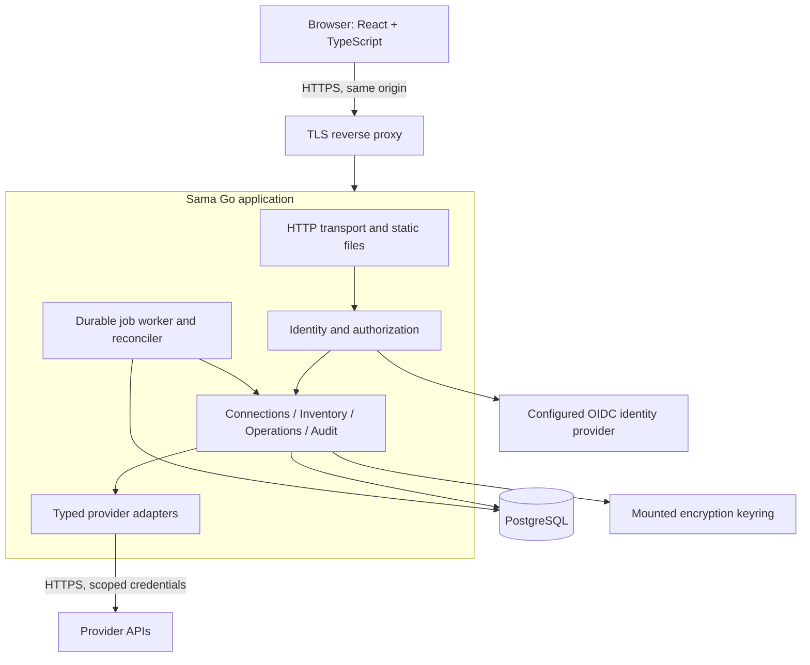

# System architecture

## Proposed design

Build a **Go modular monolith**, a **React + TypeScript SPA compiled by Webpack**, and **PostgreSQL**. Start with one application process serving API and frontend assets; add background workers to the same executable when operations are implemented. API-only and worker-only deployment modes can be introduced when load warrants separate scaling. Keep all Go source and tooling in `backend/` and all React/Webpack source and tooling in `frontend/`. Each has its own dependencies and build boundary. A combined release image is a packaging proposal, not a reason to mix source files. See [repository structure](repository.md).

This diagram describes the proposed runtime topology. No application code is present in this phase. Review the design before choosing an implementation milestone.

## Why this shape

Provider latency and failure dominate cloud operations. Go’s context propagation, HTTP support, goroutines, and single executable distribution fit this workload. A modular monolith keeps cross-module transactions and development straightforward while preventing each provider from becoming a separate service. React supplies interactive workflows; SSR adds little value to an authenticated management console. Webpack is the explicit project bundler.

PostgreSQL holds identities, encrypted connections, inventory, operations, jobs, and audit records. Using database transactions for intent + work + audit removes a distributed publish problem. The extra database process is justified by crash recovery, isolation, concurrent workers, backups, and a credible path to multiple replicas. Supporting a second SQL engine at launch would multiply correctness work.

## Backend module boundaries

The following proposed packages belong under `backend/internal/`. Frontend features have their own structure under `frontend/src/`.

| Module (target package) | Owns | Must not do |
| ----------------------- | --------------------------------------------------------------------------- | ------------------------------------------------------------------------- |
| `identity` | OIDC identity binding and sessions | Trust email as a stable subject identifier |
| `workspace` | Workspaces, memberships, connection grants | Infer access from a user-supplied workspace ID |
| `connection` | Connection metadata, validation, credential versions | Return plaintext credentials to API clients |
| `inventory` | Observed resources, snapshots, sync generations, search | Treat an incomplete page walk as resource deletion |
| `operation` | Intent, preconditions, execution state, idempotency, resource serialization | Retry ambiguous non-idempotent actions blindly |
| `audit` | Append-only allowed-field event records | Store raw provider bodies or credential values |
| `provider/<name>` | Authentication quirks, transport, normalization, native action polling | Decide workspace permissions or write directly to unrelated domain tables |
| `job` | PostgreSQL lease scheduling and bounded worker execution | Assume a lease fences external API side effects |
| `platform` | DB pool, clock, cryptography wrappers, outbound HTTP, structured logging | Absorb provider/domain business rules |
| `httpapi` | Routing, bounded decoding, status mapping, DTOs | Contain provider business logic |

Do not create empty packages for every planned module. Add them with their first vertical slice. Interfaces belong with their consumers and stay small. Provider SDK DTOs remain inside adapters. Domain services call repository ports; the PostgreSQL implementation uses `pgx` and reviewed SQL, with `sqlc` where generated query bindings reduce drift. Avoid a generic CRUD repository and reflection-based routing.

Dependencies flow from composition root to transport/services to domain contracts. Infrastructure implements those contracts. Adapters cannot import the HTTP layer. Cross-module orchestration belongs in application services, not a growing `utils` directory. Share generic transport/encryption/paging mechanisms; keep provider semantics in their owner.

## Technology choices for review

| Area | Choice | Status |
| --- | --- | --- |
| Backend | Go, with standard HTTP and structured logging support | Language requested; library choices proposed |
| Frontend | React + TypeScript, Webpack, frontend-local package management | React/Webpack requested; TypeScript proposed |
| API | REST JSON, OpenAPI contract, generated frontend types | Proposed |
| Database | PostgreSQL, `pgx`, explicit migrations; consider `sqlc` for query bindings | Proposed |
| Authentication | OIDC authorization code + PKCE, server-side opaque sessions | Proposed |
| Jobs | PostgreSQL durable queue, resource reservations, reconciliation | Proposed |
| Validation | Domain, HTTP contract, browser, isolation, and crash-recovery checks | Future acceptance strategy |
| Packaging | Independently built backend and frontend artifacts; optional combined release image | Proposed |

Select supported Go, Node LTS, React, Webpack, and PostgreSQL versions at the start of implementation, then pin them within their owning folders. No toolchain or dependency versions are installed or pinned by this documentation-only repository.

## Read and write flows

Reads authenticate once, resolve workspace permissions, query bounded local inventory, and return resource observations and freshness. They do not wait for every upstream provider. Explicit sync requests enqueue coalesced refreshes per connection/type/region. Failed upstream work is isolated per scope.

Writes authorize and prepare a review from fresh provider state. Confirmation atomically consumes that review and writes operation + job + audit intent. The worker rechecks authority and connection status, executes once or enters reconciliation, then records outcome with provider references. A synchronous API call cannot bypass the durable operation service. Details: [operation lifecycle](operations.md).

## Deployment and evolution

Initial self-hosting: TLS proxy + Sama + PostgreSQL on a single host. PostgreSQL is private; app egress is restricted to configured identity/provider destinations. Horizontal app replicas share sessions and durable jobs in PostgreSQL. Start with a single worker process for simple global provider rate limiting; distributed rate budgeting is a prerequisite for multiple worker replicas.

Extract a service only after measuring a need for independent ownership, isolation, or scaling. Large object transfers and prolonged console sessions, if added, deserve a separate resource budget and potentially a separate process. Do not introduce Kubernetes, Redis, a service mesh, or Kafka merely to anticipate scale.
