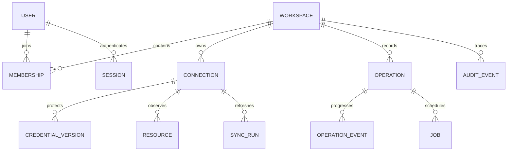

# Data model and consistency

PostgreSQL 18 is the target store; its transaction and row-lock semantics underpin the worker design. Consult [PostgreSQL locking](https://www.postgresql.org/docs/current/explicit-locking.html) when implementing.

## Model

Use application-generated UUIDv7 entity keys, native PostgreSQL `uuid` columns, UTC `timestamptz`, explicit foreign keys, and versioned migrations. The field name `id` refers to the UUID; it does not mean an auto-increment integer. Provider IDs are opaque text, never converted to integers across the boundary. Never assume global uniqueness of a provider ID. Resource identity includes connection, API family, resource type, region/scope, and native ID.

| Table | Important fields and constraints |
| --------------------- | ------------------------------------------------------------------------------------------------------------------------------------------------------------------------------------------------------------------------------------------------------------------------------------------------------- |
| `users` | `id`, `issuer`, `subject`, display name; unique `(issuer, subject)`. Email is optional metadata, not an identity key. |
| `workspaces` | `id`, name, timestamps, policy version. |
| `memberships` | `(workspace_id, user_id)` primary key, role, version. Only current members can act; preserve historical actor IDs after removal. |
| `connection_grants` | `(workspace_id, connection_id, user_id)`, permitted action classes. Composite foreign keys enforce membership and connection workspace. No grants outside role ceilings. |
| `sessions` | Digest of random opaque session ID, user, expiry, last activity, authentication time, CSRF binding; never store the browser token plaintext. |
| `connections` | `(workspace_id, id)` unique, provider, API family, account/project identity, region policy, label, status, active credential version, permission verification timestamp. |
| `credential_versions` | Workspace and connection IDs, ciphertext, nonce, wrapped data key, wrapping nonce, encryption format, master key ID, version, created/revoked timestamps. Composite FK to connection. |
| `resources` | Workspace, connection, type, non-null scope (use an explicit global scope), native ID, native status, normalized status, safe display fields, details schema version, observation time, generation, tombstone time, optimistic version. Unique `(workspace_id, connection_id, type, scope, native_id)`. |
| `sync_runs` | Scope, generation, status, page counts, started/completed times, bounded error category, next cursor checkpoint if restart-safe. Only a complete run advances the visible generation. |
| `action_reviews` | User/workspace/connection/target, typed intent and hash, precondition fingerprint, impact summary, credential/policy versions, expiry, consumed-by-operation; consume once. |
| `operations` | Workspace, actor, connection, target identity (or creation slot), action, immutable intent/hash, idempotency key, state, review ID, credential version, provider action/request references, deadlines, timestamps. Unique `(workspace_id, actor_id, idempotency_key)`. |
| `operation_events` | Append-only sequence per operation, from/to state, timestamp, allowed-field diagnostic summary; composite FK to workspace/operation. |
| `jobs` | Workspace, connection, operation or sync reference, type, payload schema version, state, next run time, lease owner/token/expiry, attempt count, deadline. No credentials or unrestricted payload dumps. |
| `resource_locks` | Workspace/connection/type/scope/native ID or creation slot; owning operation, fencing version. Locks for ambiguous mutations survive a worker lease expiring. |
| `audit_events` | UUIDv7 `id`, workspace, actor kind/ID, action, target, outcome, request/operation IDs, timestamp, selected diff metadata. Append-only to the runtime role. |

Tenant-bearing references use composite foreign keys `(workspace_id, referenced_id)`, even when identifiers are globally unique. This prevents a valid ID from one tenant being linked into another tenant’s operation. Access queries include workspace **and** connection permissions; authorization cannot be delegated to UUID unpredictability.

Keep only allowed display metadata in resource details JSONB, with a versioned schema and size cap (initial target: 64 KiB per resource). No user-data scripts, passwords, private keys, raw token responses, object contents, or queue messages. Do not store entire SDK responses for debugging. Size limits also apply before JSON parsing on the outbound client.

## Identifier policy

Use the same UUIDv7 for a Sama entity inside PostgreSQL and in the API. There is no separate `internal_id`/`public_id` mapping in the baseline. Keep familiar names such as `id`, `workspace_id`, and `connection_id`; document their UUID type in the schema. API JSON and URLs use canonical lowercase hyphenated strings; frontend code treats them as opaque strings, never JavaScript numbers.

Generate the UUID once in the Go application before assembling a related transaction or credential encryption context, using an RFC 9562-compatible implementation selected during coding. Enforce primary/unique keys in PostgreSQL. Do not generate a new resource identity on each sync; upsert against the composite provider identity and preserve Sama's UUID.

UUIDv7 has a time-ordered component, which is a useful basis for insertion locality compared with purely random keys, not proof of faster queries in Sama. It also exposes approximate generation time. It does not guarantee transaction commit order or eliminate the need for explicit timestamps, stable cursors, and per-operation event sequence numbers. PostgreSQL stores UUIDs as a native 128-bit type; UUIDv7 is defined by RFC 9562. [UUID type](https://www.postgresql.org/docs/current/datatype-uuid.html), [UUID specification](https://www.rfc-editor.org/rfc/rfc9562.html)

| Identifier category | Rule |
| --- | --- |
| Independently identified entities | UUIDv7 primary key; same value shared with authorized frontend clients |
| Memberships/grants and other associations | Composite UUID foreign keys can be the primary key; no unnecessary extra ID |
| Provider native IDs | Preserve opaque provider values, qualified by connection, API family, resource type, and scope |
| Event ordering, versions, counters | Explicit numeric sequence/version fields when needed; these are not alternate public identities |
| Session, CSRF, invitation, and reset secrets | Independent cryptographically random tokens; never use UUIDv7 as a secret |
| Request correlation and native idempotency | Follow the receiving protocol; an adapter may require a UUIDv4 correlation value, separate from entity identity |

An installation being self-hosted or organization-centric does not remove permission boundaries. Numeric IDs can be safe with correct authorization, and UUIDs do not make an endpoint safe by themselves. Every query and mutation still enforces membership, workspace, and connection scope.

A numeric surrogate plus stable public UUID may be considered for a particular high-volume table only after representative measurements demonstrate a material benefit that outweighs extra indexes, joins, and mapping logic. This is not a default optimization and is not an implemented fallback. Record any such amendment explicitly; never change public identities simply to tune a query.

## Indexes and access patterns

Index inventory on `(workspace_id, type, id)` and `(workspace_id, connection_id, type, scope, id)`; add status/region indexes based on measured queries. Use cursor pagination with a stable sort and unique ID tie-breaker. Search indexes cover safe names and identifiers only. Avoid leading wildcard searches across unbounded JSON.

Index ready jobs on `(next_run_at, id)` restricted to claimable states, expired leases on `(lease_expires_at)`, operation lists on `(workspace_id, created_at DESC, id DESC)`, audit history on `(workspace_id, created_at DESC, id DESC)`, and session expiry. Every list has a default page size of 50 and maximum 200. Use query plans and representative data before claiming performance.

## Transaction boundaries

- Connection creation writes connection metadata, encrypted credential version, audit event, and initial sync job in one transaction after non-mutating validation. Avoid holding a DB transaction open over a provider call.
- Mutation acceptance validates the stored review, compares hash/versions, consumes it, reserves the resource lock, and inserts operation + job + audit event atomically. A failed audit write fails acceptance.
- A worker claims work in a short transaction using row locking and a lease token; no network call occurs inside the transaction. Outcome updates require matching lease ownership and legal state transitions.
- Credential rotation writes a new version and atomically changes the active pointer with an audit event. Revoked versions cannot start new calls. Accepted but unsent operations are revalidated or cancelled; submitted operations reconcile using an authorized credential for the same verified account.
- Resource refresh stages observations by generation. Only a fully paginated, successful scan of the **same scope** may mark missing resources as tombstoned. A permission change or incomplete page walk cannot mean “deleted.” Preserve last good observations and show sync failure.

## Data lifecycle

Proposed defaults: audit and operation events retained 180 days, tombstones 30 days, terminal job payloads 7 days, expired sessions purged daily. Make retention configurable within documented minimums required for idempotency and incident analysis. Retain idempotency records at least 30 days and longer for unresolved operations; never erase the only duplicate-prevention evidence while work can still complete.

Disconnect is a soft disable first: block new work, cancel work not submitted, finish reconciliation, then retire credentials and inventory under retention policy. It never deletes provider resources. Workspace deletion is a separately designed owner-only flow with export and retention choices; do not implement cascading cloud deletion.

Credentials and backups are encrypted separately. Removing a credential from the live DB does not retroactively remove it from retained backups. Document backup retention and destroy corresponding key material only when all protected data can be retired. Audit actor metadata should be minimized; support anonymization while retaining operation accountability where required by deployment policy.

## Migration policy

Numbered forward SQL migrations run as an explicit deployment step using a migration identity; the runtime role has no DDL permissions. A schema version table and checksums prevent silent edits to applied migrations. Use expand → migrate → contract across releases; keep one-version compatibility during upgrades. Rollback application binaries only while schema compatible. For irreversible changes, restore a tested backup and reconcile provider-side actions before resuming workers. Never describe a DB rollback as rolling back cloud effects.
