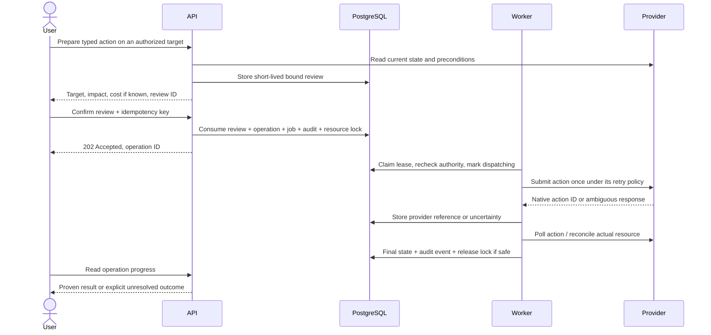

# Durable operation lifecycle

**Design required before any provider mutation is enabled.** A successful HTTP response is not necessarily a completed cloud operation. Sama provides at-least-once job delivery with action-specific duplicate prevention, not universal exactly-once external execution.

## Review, accept, execute, observe

## State machine

| State | Meaning | Allowed next states |
| ------------------ | ---------------------------------------------------------------------- | -------------------------------------------------------- |
| `queued` | Accepted, resource reserved; no provider mutation attempted | `dispatching`, `cancelled`, `failed` |
| `dispatching` | Durable marker written before crossing external side-effect boundary | `waiting_provider`, `reconciling`, `succeeded`, `failed` |
| `waiting_provider` | Submission acknowledged with a durable provider reference | `waiting_provider`, `reconciling`, `succeeded`, `failed` |
| `reconciling` | Read/poll to establish outcome; no blind resubmission | `waiting_provider`, `succeeded`, `failed`, `unknown` |
| `unknown` | Deadline exhausted or evidence insufficient; resource remains reserved | `reconciling` through an audited resolution request |
| `succeeded` | Adapter-specific success condition verified | Terminal |
| `failed` | Definite rejection/failure established; impact described | Terminal |
| `cancelled` | Cancelled before external submission | Terminal |

Unknown is not success or failure. A timeout is not proof of failure. After a provider success indication, refresh affected inventory; if provider semantics require state confirmation, that is part of the success condition. For reboot, “server is running” alone cannot prove the requested reboot occurred: require the native action record or equally strong adapter-specific evidence. Otherwise retain uncertainty.

## Idempotency and review binding

All operation submissions require a caller-generated idempotency key. Uniqueness is scoped to workspace+actor. Canonicalize the typed intent and hash action, connection, target, parameters, and review ID. A repeat key with the same hash returns the existing operation; the same key with different intent returns 409. Perform deduplication before rejecting an already-consumed review so a lost response can be recovered safely. Concurrent requests serialize on the DB unique constraint.

Reviews last five minutes initially and bind actor, workspace, target, intent hash, fresh provider preconditions, credential version, and policy version. A review cannot be transferred between users or edited by the frontend. At acceptance and dispatch, re-evaluate permissions, connection status, and critical preconditions. Changed resource facts require a new review, never silent execution of a changed plan. For actions lacking upstream compare-and-swap, explicitly acknowledge the unavoidable race with changes made directly at the provider; re-read as close to dispatch as possible and preserve native conflict handling.

Human confirmation is risk-sensitive: no confirmation for inspection; concise impact confirmation for reboot/shutdown; typed target and recent authentication for rebuild/delete/public exposure/large spend. No blanket “approve all future actions” switch. An estimate is not a hard spending guarantee.

## Jobs, leases, and serialization

Use a DB transaction to claim due jobs with `FOR UPDATE SKIP LOCKED`, write lease owner/token/expiry, and commit immediately. Starting defaults: four workers, at most two concurrent requests per connection, 60-second lease, renewal every 15 seconds. All state transitions compare the current lease token and expected state. Stop outbound work if lease renewal fails. Use a bounded HTTP deadline shorter than the lease and renewed context cancellation.

Lease expiry only grants permission to **inspect/reconcile** a `dispatching` mutation. It does not authorize a second mutation. If the first worker stalls after the dispatch marker, a replacement cannot distinguish “never sent” from “sent but response lost.” Preserve the resource lock and reconcile even if it means manual resolution. This is intentional conservative behavior. A database fencing token fences DB writes, not a remote provider API.

Use a durable reservation keyed by connection/type/scope/native ID so reboot, resize, and delete cannot race within Sama. Multi-resource operations reserve all affected resources in deterministic order or are rejected until that behavior is implemented. Creation uses a durable intent slot and provider-native idempotency/correlation where supported. Resource reservations persist through unknown outcomes; releasing them needs definitive evidence or a separately reviewed owner resolution that records residual risk. No automatic resubmission on release.

The first release uses one provider-calling process with an active worker scheduler and process-local rate budgets. Extra API replicas may serve DB-backed/local reads, but connection validation and fresh review preparation also call providers and therefore cannot multiply independently under a process-local limit. Multiple provider-calling API or worker processes require shared provider-scope concurrency and cooldown budgets, or routing all provider traffic through one designated scheduler, plus crash/partition tests. Lease correctness alone does not enforce upstream rate limits.

## Retry classification

| Event | Response |
| ------------------------------------------------------------ | ------------------------------------------------------------------------------------------------------ |
| Read timeout/temporary 5xx | Bounded exponential backoff with full jitter, max five attempts and a total deadline |
| 429 | Respect Retry-After or provider reset metadata; cool down the entire relevant credential/project scope |
| Expired token | One synchronized credential refresh for the connection/version; do not loop |
| 401 after refresh / 403 | Stop, mark connection or capability problem; do not retry indefinitely |
| Definitive validation/conflict error | Fail with safe error category; refresh target before a new review |
| Mutation timeout, connection reset after send, ambiguous 5xx | Reconcile; never classify as a safe retry merely because the HTTP status is 5xx |
| Mutation with verified native idempotency | May retry with the same native idempotency token within its documented window |
| Malformed response or missing native operation ID | Preserve dispatch evidence; reconcile and eventually show unknown |

Disable automatic SDK mutation retries unless the adapter has classified their safety. Share one end-to-end retry budget across SDK/transport/job layers to avoid multiplying attempts. Maintain adapter-specific polling intervals with jitter; defaults are starting configuration, not copied provider limits.

## Cancellation, restart and outage

Cancel is guaranteed only while queued and atomically before dispatch. Once submitted, show “cannot cancel through Sama” unless a real provider cancellation capability exists. An operation can succeed after a user leaves the page. Graceful shutdown stops claiming jobs, finishes or checkpoints bounded work, and leaves dispatching operations recoverable.

If the DB is unavailable, accept no mutations and dispatch no new work. If a provider response cannot be persisted, do not send another mutation: recovery sees the durable dispatch marker and reconciles. Audit availability is part of accepting a change. Provider outages should mark stale inventory and defer work per provider without blocking unrelated providers.

After database restore, disable dispatch globally. Restored jobs/idempotency data may precede already-completed cloud actions. Reconcile all nonterminal operations and externally affected resources before releasing the recovery gate. “Retry all failed jobs” is not a supported recovery command.

## Required empirical tests

Use a deterministic fake HTTP provider with call counters and controllable delays. Kill workers before/after dispatch marker, after request write, after upstream success and before DB commit, during lease renewal, and while a successor reconciles. Prove no second mutating call for ambiguous operations. Test duplicate keys, conflicting payloads, two operators on the same target, revoked membership, rotated/disabled credentials, stale reviews, rate-limit bursts, partial inventory, and schema upgrades with queued jobs. Repeat critical cases against disposable real provider resources before shipping each action.
